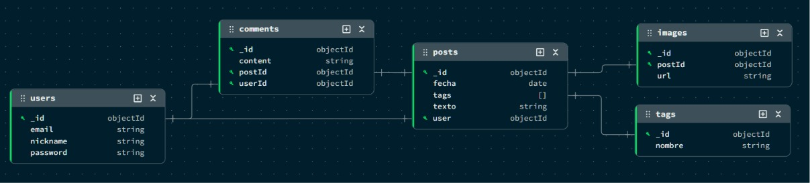

[](https://classroom.github.com/a/r_d7sOXe)
# UnaHur - Red Anti-Social - 2026 - C1

Se solicita el modelado y desarrollo de un sistema backend para una red social llamada **“UnaHur Anti-Social Net”**, inspirada en plataformas populares que permiten a los usuarios realizar publicaciones y recibir comentarios sobre las mismas.


## Tecnologías

- **Node.js**
- **Express**
- **MongoDB**
- **Mongoose**
- **Redis**
- **Joi**
- **Swagger**
- **Docker**
- **Mongo Express**
---

## Instrucciones 

### Instalación y Ejecución

1. Clonar el repositorio:

```bash
git clone https://github.com/EP-UnaHur-2026C1/anti-social-documental-tp-aagp.git
```

2. Ingresar al directorio del proyecto:

```bash
cd anti-social-documental-tp-aagp
```

3. Instalar las dependencias:

```bash
npm i
```

4. Inicializar contenedores de docker:

```bash
docker compose up -d
```

5. Ejecutar el proyecto en modo desarrollo:

```bash
npm run dev
```


## **Colección de pruebas Postman**

### Importar la colección

1. Abrir Postman.

2. Seleccionar Import.

3. Importar el archivo de la colección ubicado en:

    &#x09;docs/TP2-AAGP.postman\_collection.json

### Ejecución de las pruebas

1. Ejecutar la carpeta **Setup**
    
    Las requests de esta carpeta deben ejecutarse manualmente y en orden, ya que cada una genera las variables necesarias para la siguiente.
    
    Orden:
    
    1. Crear usuario
    2. Crear tag 1
    3. Crear tag 2
    4. Crear post
    5. Crear imagen
    6. Crear comentario

    Las variables se almacenan automáticamente durante la ejecución.

2. Ejecutar las carpetas **funcionales**
    
    Una vez completado el Setup, pueden ejecutarse las siguientes carpetas:
    - Users
    - Tags
    - Posts
    - Images
    - Comments
    - Relaciones

    Estas carpetas utilizan las variables generadas durante el Setup.

3. Ejecutar la carpeta de **errores**

    Esta carpeta contiene pruebas de:
    - IDs inválidos.
    - Recursos inexistentes.
    - Validaciones de campos obligatorios.
    - Datos con formato incorrecto.

    Estas pruebas no modifican la información almacenada.

4. Ejecutar las **eliminaciones**

    La carpeta de eliminaciones debe ejecutarse al finalizar todas las pruebas, ya que elimina los recursos creados durante el Setup.

    Orden recomendado:

    1. Eliminar comentario.
    2. Eliminar imagen.
    3. Eliminar post.
    4. Eliminar tag 1.
    5. Eliminar tag 2.
    6. Eliminar usuario.

    Una vez ejecutada esta carpeta, será necesario volver a realizar el Setup para generar nuevamente los datos de prueba.


## **Regla de negocio: visibilidad de comentarios por antigüedad**

El sistema implementa una regla de negocio que limita la visualización de comentarios antiguos en la visualización de posteos.
Los comentarios con una antigüedad mayor a un valor configurable mediante variables de entorno no se muestran en los endpoints donde se listan publicaciones.

La configuración se define en .env mediante:    

COMMENT\_VISIBLE\_MONTHS=6

### Aplicación de la regla

Esta regla se aplica en:

    GET /posts

    GET /posts/:id

    GET /users/:id/posts

y en cualquier endpoint donde los comentarios estén asociados a la visualización de un post.

Casos donde **NO** se aplica el filtro:

No se aplica la restricción temporal en endpoints de consulta directa de comentarios, como:

    GET /comments

    GET /users/:id/comments

ya que en estos casos los comentarios se consideran parte del historial del usuario y no de la visualización de publicaciones.

### Implementación

La lógica de filtrado se centraliza en:

&#x09;utils/obtenerComentariosVisibles.js

para asegurar consistencia en todos los endpoints que requieren la regla de negocio.

### Cómo probar esta funcionalidad

Como la regla depende del tiempo de creación de los comentarios, se recomienda ajustar temporalmente la variable de entorno para facilitar las pruebas.

**Opción 1:** 

Reducir el valor de la variable en el archivo .env:

COMMENT\_VISIBLE\_MONTHS=0

De esta forma, solo se mostrarán los comentarios creados en el momento de la ejecución.

**Opción 2:** 

Crear comentarios con diferentes fechas de creación (por ejemplo, mediante ajustes en la base de datos o datos de prueba) para simular comentarios antiguos y verificar el filtrado por antigüedad.

## Estructura

```text
.
├── assets
│   ├── ANTI-SOCIALNET.jpeg
|   ├── diagrama.jpeg
│   └── Referenciada.png
├── src
│   ├── config
│   │   ├── db.js
│   │   ├── redis.js
│   │   └── swagger.js
│   ├── controllers
│   │   ├── comment.controller.js
│   │   ├── image.controller.js
│   │   ├── post.controller.js
│   │   ├── tag.controller.js
│   │   └── user.controller.js
│   ├── docs
│   │   ├──TP2--AAGP.postman_collection.json
│   │   └── swagger.yaml
│   ├── middlewares
│   │   ├── existenciaUnicoTag.js
│   │   ├── validarComentarioId.js
│   │   ├── validarComentario.js
│   │   ├── validarCommentAct.js
│   │   ├── validarExistenciaPost.js
│   │   ├── validarExistenciaTags.js
│   │   ├── validarImageId.js
│   │   ├── validarImage.js
│   │   ├── validarImgAct.js
│   │   ├── validarPostAct.js
│   │   ├── validarPostCache.js
│   │   ├── validarPostId.js
│   │   ├── validarPostIdParam.js
│   │   ├── validarPost.js
│   │   ├── validarTagId.js
│   │   ├── validarTag.js
│   │   ├── validarTagsPost.js
│   │   ├── validarUserComment.js
│   │   ├── validarUserId.js
│   │   ├── validarUser.js
│   │   └── validateObjectId.js
│   ├── models
│   │   ├── comment.js
│   │   ├── image.js
│   │   ├── index.js
│   │   ├── post.js
│   │   ├── tag.js
│   │   └── user.js
│   ├── routes
│   │   ├── comment.routes.js
│   │   ├── image.routes.js
│   │   ├── post.routes.js
│   │   ├── tag.routes.js
│   │   └── user.routes.js
│   ├── schemas
│   │   ├── commentSchemaAct.js
│   │   ├── comment.schema.js
│   │   ├── imageAct.schema.js
│   │   ├── image.schema.js
│   │   ├── postAct.schema.js
│   │   ├── post.schema.js
│   │   ├── postTag.schema.js
│   │   ├── tag.schema.js
│   │   └── user.schema.js
│   └── utils
│       ├── agregarRelacionesPosts.js
│       └── obtenerComentariosVisibles.js
├── app.js
├── docker-compose.yml
├── package.json
├── package-lock.json
└── README.md

```
## Diagrama



## Endpoints

### User

| Método| Ruta | Descripción | Middleware |
| ----- | ---- | ----------- | ---------- |
| `` GET ``| ``/users`` | Obtener todos los usuarios |  |
| `` GET ``| ``/users/:id`` | Obtener un usuario por su id | ``validateObjectId`` ``validarUserId`` |
| `` GET ``| ``/users/:id/posts`` | Obtener todos los post de un usuario | ``validateObjectId`` ``validarUserId`` |
| `` GET ``| ``/users/:id/comments`` | Obtener todos los comentarios de un usuario | ``validateObjectId`` ``validarUserId`` |
| ``POST``| ``/users`` | Crear un usuario | ``validarUser`` |
| `` PUT ``| ``/users/:id`` | Actualizar usuario | ``validateObjectId`` ``validarUserId`` ``validarUser`` |
| `` DELETE ``| ``/users/:id`` | Eliminar usuario | ``validateObjectId`` ``validarUserId`` |

### Post

| Método| Ruta | Descripción | Middleware |
| ----- | ---- | ----------- | ---------- |
| `` GET ``| ``/posts`` | Obtener todos los posts | ``validarPostCache`` |
| `` GET ``| ``/posts/:id`` | Obtener un post por su id | ``validateObjectId`` ``validarPostId`` |
| ``POST``| ``/posts/`` | Crear post | ``validarUserId`` ``validarPost`` ``validarExistenciaTags`` |
| `` PATCH ``| ``/posts/:id`` | Actualizar contenido de un post | ``validateObjectId`` ``validarPostId`` ``validarPostAct`` |
| ``PATCH``| ``/posts/:id/tags`` | Agregar tag a un post | ``validateObjectId`` ``validarPostId`` |
| `` DELETE ``| ``/posts/:id`` | Eliminar post | ``validateObjectId`` ``validarPostId`` |
| `` DELETE ``| ``/posts/:id/tags/:tagId`` | Eliminar tag de un post | ``validateObjectId``  ``validarPostId`` ``existenciaUnicoTag`` |
| `` DELETE ``| ``/posts/:id/tags`` | Eliminar todos los tags de un post | ``validateObjectId`` ``validarPostId``  |

### Tag

| Método| Ruta | Descripción | Middleware |
| ----- | ---- | ----------- | ---------- |
| `` GET ``| ``/tags`` | Obtener todos los tags | |
| `` GET ``| ``/tags/:id`` | Obtener un tag por su id | ``validateObjectId`` ``validarTagId`` |
| ``POST``| ``/tags`` | Crear un tag | ``validarTag`` |
| `` PUT ``| ``/tags/:id`` | Actualizar tag | ``validateObjectId`` ``validarTag`` ``validarTagId`` |
| `` DELETE ``| ``/tags/:id`` | Eliminar tag | ``validateObjectId`` ``validarTagId`` |

### Comment

| Método| Ruta | Descripción | Middleware |
| ----- | ---- | ----------- | ---------- |
| `` GET ``| ``/comments`` | Obtener todos los comments | |
| `` GET ``| ``/comments/post/:postId`` | Obtener todos los comments de un post |``validarPostIdParam`` |
| `` GET ``| ``/comments/:id`` | Obtener un comment por su id | ``validateObjectId`` ``validarComentarioId`` |
| ``POST``| ``/comments`` | Crear un comment | ``validarComentario`` ``validarUserComment`` ``validarExistenciaPost`` |
| `` PUT ``| ``/comments/:id`` | Actualizar contenido de un comment | ``validateObjectId`` ``validarComentarioId`` ``validarCommentAct`` |
| `` DELETE ``| ``/comments/:id`` | Eliminar comment | ``validateObjectId`` ``validarComentarioId`` |

### Image

| Método| Ruta | Descripción | Middleware |
| ----- | ---- | ----------- | ---------- |
| `` GET ``| ``/images`` | Obtener todas las images||
| `` GET ``| ``/images/:id/`` | Obtener una image por su id | ``validateObjectId`` ``validarImageId`` |
| ``POST``| ``/images`` | Crear image | ``validarImage`` ``validarExistenciaPost`` |
| `` PUT ``| ``/images/:id`` | Actualizar url de una iamge | ``validateObjectId`` ``validarImgAct`` ``validarImageId`` |
| `` DELETE ``| ``/images/:id`` | Eliminar image | ``validateObjectId`` ``validarImageId`` |

## Integrantes

| Nombre | GitHub |
|------------|---------|
| Avila, Paz Maria | https://github.com/pazm-avila |
| Barbosa, Gonzalo Nicolas | https://github.com/gonnbar |
| Peralta, Melanie Ailen | https://github.com/ailenperalta |
| Rodriguez, Ana Paula | https://github.com/anapauula1 |
